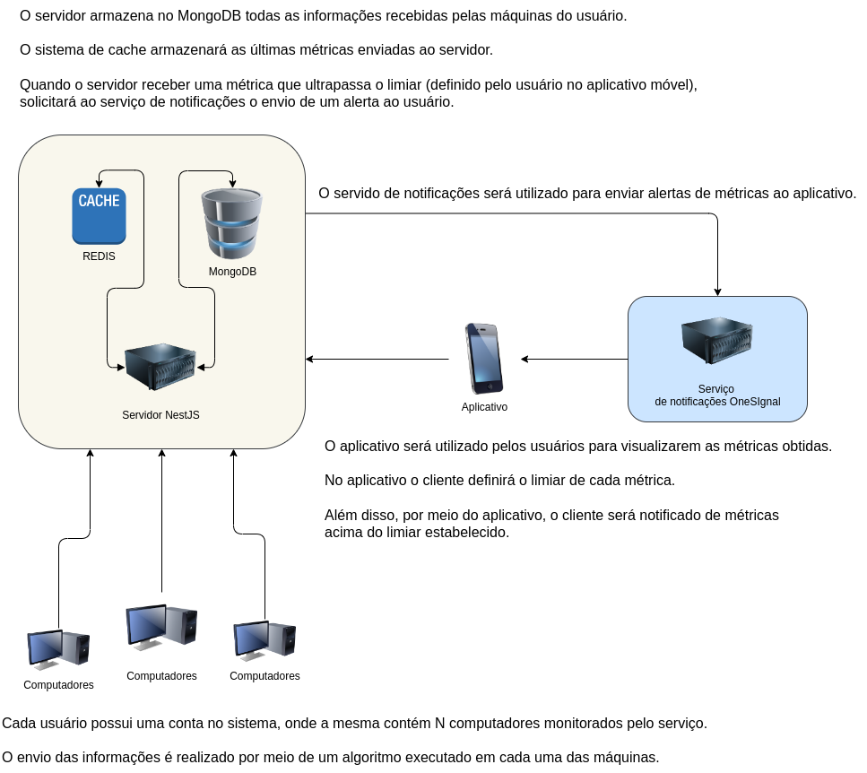

# Sistema de monitoramento de computadores

## Aplicativo (React Native)

- O usuário poderá criar sua conta ou realizar login
- Autenticação via HTTP
- Tela para configurar limiar de cada máquina
- Sistema de push notificacation para alerta de métricas acima do limiar

## Servidor (NestJS)

- Sistema de cache das estatísticas de cada computador utilizando REDIS
- Usar MongoDB para armazenar os dados
- Envia notificação ao aplicativo do usuário caso alguma métrica for acima do limiar estabelecido. O envio será efetuado via o serviço Onesignal.
- Implementar sistema de replicação no sistema de notificação push.
- Micro-serviço de notificação caso algum parâmetro passe do limiar estabelecido pelo usuário.

## Algoritmo de monitoramento (Python)

- Envia as estatísticas periodicamente para o servidor armazenar
- Quando o usuário rodar o script de monitoramento na máquina alvo
- Pede usuário e senha da conta do sistema
- Realiza autenticação com o servidor utilizando HTTP’s (criptografando dados)
- Envia solicitação de cadastro da máquina no sistema usando HTTP
- Inicia o monitoramento e envia esporadicamente os dados via HTTP’s (criptografando os dados)
- Caso cliente ocorra falha no envio dos dados, os mesmos serão armazenados e enviados posteriormente.

## :mortar_board: Autores

<table><tr>

<td align="center"><a href="https://github.com/JessePires">
 
 
 <b>Jessé Pires</b>
 </a> 

</td>

<td align="center"><a href="https://github.com/jhonatancunha">
 
 
 <b>Jhonatan Cunha</b></a>
 

</td>

</tr></table>

